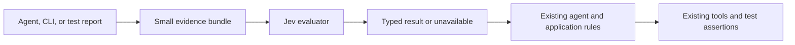

# Jev integration and app output-review plan

Researched September 22, 2026. Research used three subagents for official documentation, repository architecture, and automation/testing review. The design below is the research baseline; the initial implementation is described next. Live synthetic validation has now passed; no real-world accuracy benchmark has been run.

**Current priority, September 22:** the user is testing Jev and wants it integrated into the app to help review outputs. Next build explicit output review, followed by optional review on completion after evaluation. Skill suggestions and action selection remain later experiments. See the [workspace roadmap](/Users/alfredo/Documents/code-daddy/plans/README.md) and [documentation map](/Users/alfredo/Documents/code-daddy/documentation/README.md). No app output-review control has shipped yet.

**Audience/language scope:** this is a private app for the owner and a few friends, with English as the only required UI language. Use real tasks from this group to evaluate usefulness. Keep bounded, trustworthy review results, but do not add multilingual evaluation, public onboarding, or enterprise rollout work. This does not restrict which programming languages or documents the coding agent can work with.

## Initial implementation

The [Jev package](/Users/alfredo/Documents/code-daddy/packages/jev/README.md) now contains the shared evaluator, private settings reader, CLI, and two advisory plugin operations. The repository plugin entry supports both legacy sessions used by the current desktop and the V2 registry. Both paths reuse the evaluator and preserve their existing permission mechanisms. The CLI includes synthetic examples and a separate live evaluation command; normal test execution remains deterministic. Future skill suggestions and computer-control pilots remain proposed work.

Put the TypeSafe API key in `~/.config/code-daddy/jev.env` as `TYPESAFE_API_KEY=...`, then run `bun run jev check` and `bun run jev smoke` from `packages/jev`. Full setup, commands, input limits, and evaluation limitations are in the package README. The private file lives outside the repository.

Live validation on September 22 used `jev-1.13.0` and question revision `jev-pilot-2026-09-22`: the smoke request succeeded, research ranking placed the official model excerpt first and recognized its contradiction of the supplied screenshot-support claim, and all 10 synthetic triage examples matched their expected categories. The 10-case run answered every case with observed request durations of 276–791 ms. The missing-environment example had confidence 0.41, illustrating ambiguity between environment and test setup even when the top label matches. These small synthetic checks validate connectivity and example behavior, not production accuracy or prompt-injection resistance. The key was moved from the duplicate project file into the private settings file with owner-only permissions; no key was printed or retained in repository files.

## Recommendation

Keep the reusable evaluator in the backend or local analysis process. Failure triage and research relevance are implemented. Next add narrow output-review criteria and an app flow exposing the reviewed evidence and result. Expand to skill suggestions and browser action selection only after measuring usefulness on this project's examples.

## App integration roadmap

The [package README](/Users/alfredo/Documents/code-daddy/packages/jev/README.md) owns implemented commands and settings. The operations and controls below are proposals, not existing CLI commands or API endpoints.

### J1 — Evaluate the ongoing tests

Review the saved [Core audit](/Users/alfredo/Documents/code-daddy/plans/validation/jev-audit-core.md) and [platform audit](/Users/alfredo/Documents/code-daddy/plans/validation/jev-audit-platform.md). Confirm candidates through source and deterministic reproduction; distinguish intentional migration gaps from regressions. Preserve original evidence and record disposition separately.

Add real labeled cases of incomplete answers, unsupported completion claims, useful answers, and insufficient evidence. Reserve an untouched holdout; compare Jev-assisted review with the existing workflow and simple checks. Ten synthetic examples are not enough to establish production quality.

The [response diagnostic](/Users/alfredo/Documents/code-daddy/plans/validation/jev-audit-response-diagnostic.md) records an `invalid_response` that did not recur in two later calls. If it recurs, record only a sanitized validation category such as `answer_ids`, `score_shape`, or `probability_distribution`. Preserve strict validation. Unavailable is neither a finding nor a successful review.

Acceptance: cases have provenance and expected outcomes; uncertain cases remain identifiable; deterministic tests require no live model calls.

### J2 — Add a shared output-review operation

Extend the existing evaluator/schema/plugin boundaries. Proposed input: explicit requirements, the selected completed response, bounded source/tool/test excerpts with stable IDs, and the source snapshot they describe. Version independent, narrow criteria:

- Does the response address the supplied requirement?
- Does the supplied evidence support its claim that a check passed?
- Does it distinguish completed work from unresolved work?
- When reporting an error, does it describe an actionable next step?

Return typed assessments such as supported, concern, or insufficient evidence, plus rubric revision, model, distributions/confidence where applicable, duration, and usage. Preserve invalid-input/unavailable outcomes. Bind results to project, session, message, and evidence digest. Validate all evidence references against the submitted bundle. The app owns labels and rubric explanations; do not assume Jev produces a reliable free-form review paragraph. Its API answers typed questions. [TypeSafe API](https://docs.typesafe.ai/api)

Reuse backend/private settings, plugin permissions, cancellation, and durable tool results. Submitted code/output is untrusted evidence. Scores cannot grant tool access, change test results, or authorize actions. Jev reviews the selected bundle, not an independently inspected repository.

Acceptance: fixtures cover supported/contradictory/missing evidence, invalid IDs, malformed answers, timeout, cancellation, and permission denial. Results survive reload through the existing durable result path. Avoid storing duplicate raw source bundles when references/digests suffice.

### J3 — Add an explicit app review flow

Start with an action on a completed response or task result. Show the selected requirements and evidence, then display criterion results and source links alongside the original output. Distinguish not reviewed, reviewing, reviewed with findings, insufficient evidence, unavailable, and stale. Add clear English labels through the existing English dictionary/copy APIs; non-English translations are not required.

Provide **Address findings** as an editable draft for the main coding agent, preserving existing draft content. Subsequent edits or different output make the old review stale. Do not silently interpret it as approval of new content.

Reuse canonical plugin tools and the compatibility adapter where possible. If a public Protocol/HttpApi change is needed, regenerate Client from `packages/client`; do not edit generated files directly. Retain the active legacy path until required V2 parity is demonstrated.

Acceptance: browser fixtures cover review, unavailable/retry, stale evidence, reload, keyboard use, and follow-up draft preservation. Live/native acceptance is separate. Exact test assertions remain the CI oracle.

### J4 — Offer optional review on completion

After the explicit flow improves held-out outcomes, add an opt-in workspace setting. Deduplicate by operation, workspace/session/message, evidence digest, rubric revision, and model. Avoid recursively reviewing reviewer output; cancel abandoned work; bound concurrency, retries, total duration, and spend. Generation must finish even when review is unavailable.

Measure missed issues, false alarms, abstention/coverage, user dismissal, latency, cost, and useful corrective follow-ups. Select thresholds using held-out results; confidence is not an established accuracy percentage. Keep deterministic verification and advisory review distinct. [Confidence semantics](https://docs.typesafe.ai/confidence)

Acceptance: automatic review is reversible, cannot create a review loop or silently bill through another provider, and is useful enough that users keep it enabled.

### Transport and free-model access

Keep direct TypeSafe working during the user's tests. An optional Zen adapter is separate work: official docs expose `https://opencode.ai/zen/v1/systemone` with a Zen API key and limited-time `jev-1.13-free`. [Zen Jev endpoint](https://opencode.ai/docs/zen/#jev)

The current package fixes its normal endpoint to TypeSafe and uses a direct model identifier. A Zen adapter requires explicit transport/auth/model mapping and contract fixtures; changing only `TYPESAFE_MODEL` is insufficient. Do not change the user's route or credentials during ongoing tests, send one provider's credentials to another, or silently fall back from free to paid. Recheck availability and provider data terms when enabling that option.

Keep the existing coding model responsible for planning, writing, debugging, and explanations. TypeSafe explicitly describes Jev as a decision component inside an application or agent; its official skill teaches API usage and does not change the model powering a coding agent. [Jev with coding agents](https://docs.typesafe.ai/introduction/coding-agents)

The evaluator performs an API request and returns advice. It does not execute shell commands, click controls, grant permissions, or modify test outcomes.

## Repository integration points

The preferred Code Daddy integration is an external V2 plugin with a small number of bounded advisory tools. These are verified source paths in the current working tree:

| Existing component | Evidence | Integration implication |
| --- | --- | --- |
| System One proxy | [provider adapter](/Users/alfredo/Documents/code-daddy/packages/console/app/src/routes/zen/util/provider/systemone.ts:8), [HTTP route](/Users/alfredo/Documents/code-daddy/packages/console/app/src/routes/zen/systemone/v1/systemone.ts:4) | Console has transport support; this does not make Jev an agent model |
| External plugin discovery | [plugin loader](/Users/alfredo/Documents/code-daddy/packages/core/src/config/plugin/external.ts:32) | Use an installable extension rather than changing the runner |
| Plugin tool registration | [host bridge](/Users/alfredo/Documents/code-daddy/packages/core/src/plugin/host.ts:223) | Existing bridge registers canonical tools and checks PermissionV2 |
| V2 plugin dependencies | [PluginV2](/Users/alfredo/Documents/code-daddy/packages/core/src/plugin.ts:172) | Plugin tools use the Location-scoped registry and permission services |
| Durable tool execution | [runner materialization](/Users/alfredo/Documents/code-daddy/packages/core/src/session/runner/llm.ts:225), [tool settlement](/Users/alfredo/Documents/code-daddy/packages/core/src/session/runner/llm.ts:272) | Advice enters the normal recorded tool-result path |
| Skill availability | [skill guidance](/Users/alfredo/Documents/code-daddy/packages/core/src/skill/guidance.ts:40), [skill loader](/Users/alfredo/Documents/code-daddy/packages/core/src/tool/skill.ts:57) | Restrict recommendations to available, permitted skills |
| Existing verification | [plugin tool tests](/Users/alfredo/Documents/code-daddy/packages/core/test/plugin/tool.test.ts:14) | Extend existing registration, permission, execution, and disposal coverage when implementing |

Proposed module responsibilities: a transport module calls TypeSafe; a question module owns versioned rubrics; a plugin facade exposes the initial operations; a CLI uses the same evaluator for test artifacts. Final packaging should follow the existing external plugin format. Start with failure triage and evidence ranking; add other operations only when their evaluations justify them.

A skill alone supplies instructions, not an API client or tool. The official TypeSafe skill is optional implementation documentation; the custom plugin supplies the actual tools. For use in other coding environments, reuse the evaluator through a CLI first and a custom MCP adapter if needed.

Preserve the repository's dependency direction and Location scoping. Do not move decisions into prompt admission or SessionExecution, alter queue/steer behavior, replace `llm.stream`, or inject advice directly into durable context epochs. The existing tool result path supplies the next turn's context. No public Protocol/HttpApi change is needed for this pilot; if later UI work changes those contracts, regenerate Client using the repository instructions.

The most concrete pilot consumes existing test artifacts. [Playwright configuration](/Users/alfredo/Documents/code-daddy/packages/app/playwright.config.ts:10) already captures traces, screenshots, and video. [Error collection](/Users/alfredo/Documents/code-daddy/packages/app/e2e/utils/errors.ts:3) and the [visual stability reporter](/Users/alfredo/Documents/code-daddy/packages/app/e2e/utils/visual-stability/reporter.ts:13) provide useful text/JSON inputs. Preserve the [deterministic analyzer](/Users/alfredo/Documents/code-daddy/packages/app/e2e/utils/visual-stability/analyzer.ts:36) as the test oracle. The [E2E policy](/Users/alfredo/Documents/code-daddy/packages/app/e2e/AGENTS.md:8) requires isolated deterministic data and exact outcomes, so live Jev evaluation belongs in a separate optional artifact-analysis command, not the normal assertion path or required CI.

Desktop automation needs more groundwork: the current [desktop scripts](/Users/alfredo/Documents/code-daddy/packages/desktop/package.json:13) provide build/package workflows but no native Electron E2E command. Existing tests cover extracted logic, such as [window persistence](/Users/alfredo/Documents/code-daddy/packages/desktop/src/main/window-registry.test.ts:17). Build an accessibility/text observation harness or Electron automation harness before attaching Jev. Keep credentials outside the renderer and preserve the existing preload/IPC boundary. This investigation found no ready Jev browser or desktop controller.

## Ranked uses

| Order | Integration | Input and output | Why start here |
| --- | --- | --- | --- |
| 1 | Test failure triage | Failed assertion, nearby log excerpt, known environment facts → likely category or insufficient evidence | Useful after a failure; does not add latency to successful tests |
| 2 | Research relevance | User question and retrieved passages → per-passage relevance and support judgments | Reduces material the main model needs to inspect; retain source IDs and URLs |
| 3 | App output review | Requirement, completed response, and supplied evidence → independent criterion results | Next user-requested product increment; start explicitly, then evaluate optional automatic review |
| 4 | Skill suggestions | Task and available skill descriptions → shortlist, then optional suggestion | Later experiment; preserve explicit instructions and available tools |
| 5 | Browser action selection | Fresh interface snapshot and allowed actions → action ID or abstain | Needs additional executor checks and a dedicated benchmark |
| 6 | Desktop action selection | Accessibility data, or text from a separate perception system → bounded action suggestion | More integration effort where interfaces expose little structured information |

For research, preserve contradictory evidence instead of filtering solely for agreement. Keep citation verification scoped to the supplied source; Jev does not independently retrieve the web. TypeSafe provides examples for [passage classification](https://docs.typesafe.ai/cookbooks/classifying_rag_passages) and [citation checking](https://docs.typesafe.ai/cookbooks/citation_check).

For skills, rank candidates, inspect a small shortlist more deeply, and allow “none.” Keep the main agent's judgment and explicitly requested skills intact. The official [skill suggestion example](https://docs.typesafe.ai/cookbooks/skill_suggestion) uses this two-stage pattern; its published results concern a different harness and model version and do not establish improvement here.

## Evaluator contract

Proposed operation names below are our application interface, not TypeSafe API methods:

- `triage_failure`: fixed categories such as application, environment, test setup, timing, and insufficient evidence; these are hypotheses, not root-cause proofs.
- `rank_evidence`: candidate IDs with relevance scores; preserve the original source mapping.
- `suggest_skill`: zero or one recommendation from the caller's available catalog.
- `evaluate_requirement`: one narrow criterion at a time with an explicit insufficient-evidence outcome where needed.

Use a shared internal request function and centrally versioned question definitions. Return a discriminated result: successful evaluation, unavailable service, or invalid input. A timeout must never become “pass,” “safe,” or “no issue.” A successful evaluation may still abstain.

TypeSafe's endpoint is `POST https://api.typesafe.ai/v1/systemone`, authenticated with a bearer key. Supply `model`, `state`, and `questions`; receive `answers`, resolved `model`, and `usage`. Choice selects a defined option, Score evaluates ordered rubric levels, and Noul returns a yes/no probability. [API reference](https://docs.typesafe.ai/api)

Put evidence in named state fields and actual decision criteria in each question. Question IDs only identify responses; they do not substitute for instructions. Do not ask “is this good?” Ask something specific, such as whether the supplied error message describes an action the user can take.

Batch independent questions sharing the same evidence. Questions cannot consume another question's answer inside that batch; use a later call or ordinary code for dependent decisions. [State](https://docs.typesafe.ai/concepts/state), [batching pattern](https://docs.typesafe.ai/patterns/fan-out)

## Transport and operating behavior

Use the official JavaScript SDK in a backend or local process, with `TYPESAFE_API_KEY` supplied through the process environment. Start with direct TypeSafe access to isolate the pilot from gateway provisioning. Reuse the existing System One proxy later if centralized billing/routing is useful and its deployed model configuration is verified. [JavaScript SDK](https://docs.typesafe.ai/sdk/javascript)

Pin the model and question revision for evaluations. As checked today, the documented stable version is `jev-1.13.0`; input costs $0.042 per million tokens and output is free. At that rate, 10,000 calls averaging 2,000 billed input tokens cost about $0.84 before retries or gateway charges. Measure actual usage instead of estimating from source text length. [Models and pricing](https://docs.typesafe.ai/models)

Set a total deadline using a cancellation signal and bounded retries. The SDK's timeout is per attempt, not a total budget, and its request signal cancels pending retries as well. As initial targets to validate, allow two seconds for optional interactive advice and ten seconds for asynchronous failure reports; use the existing path on timeout. These are proposed budgets, not measured Jev latency. [Client settings](https://docs.typesafe.ai/sdk/javascript/api/interfaces/TypeSafeClientConfig), [request options](https://docs.typesafe.ai/sdk/javascript/api/interfaces/RequestOptions)

Record operation, model version, question revision, duration, usage, result, and fallback reason. Avoid debug body logging for source code or user content. If caching is useful, include evidence, questions, candidate catalog, pinned model, and workspace identity in the key. Browser action advice must be tied to its snapshot and cannot be reused after the interface changes.

## Browser and desktop use

Jev accepts text/JSON, not screenshots. Browser DOM/accessibility observations can supply structured state. Desktop accessibility observations can do the same; image-only interfaces require a separate vision or OCR step, which may lose spatial information. [Supported inputs](https://docs.typesafe.ai/models)

For a browser pilot, use a disposable local app and a fixed task such as opening settings. Capture the current controls, let Jev select an observed action ID, verify that the target is still present and enabled, execute through the existing browser tool, and assert the result. Re-observe after every action. Include stop/abstain, a step limit, and repeated-state detection.

Keep authorization and tool policy outside the model. A high score cannot authorize a destructive action. Page text is untrusted evidence; precise prompts alone do not make it a security boundary. TypeSafe explicitly documents susceptibility to adversarial content, irrelevant context, indirection, and numerical errors. [Known limitations](https://docs.typesafe.ai/model-jaggedness/jev-1.13)

## Testing and promotion criteria

Run existing deterministic tests normally. Evaluate Jev separately so provider downtime or output variation does not make the normal test suite flaky. Exact status codes, persisted state, button presence, arithmetic, and permission enforcement remain ordinary assertions.

Start with a small labeled corpus, for example 100 varied failure/research cases, including ambiguous and insufficient-evidence cases. Keep a held-out portion untouched while tuning. This is a pilot size, not enough evidence to claim production reliability for rare failures.

Compare the current workflow, simple rules, and Jev-assisted workflow. Measure per-class precision/recall, abstention rate, coverage at the selected thresholds, confidently wrong outputs, p50/p95 latency, cost, and actual reduction in manual work or main-model input. For browser trials also measure successful task completion, wrong actions, loops, and stale-target rejection.

Choice/Score confidence summarizes the answer distribution; a value of 0.9 is not a demonstrated 90% accuracy rate. Noul is a yes-probability and has no separate confidence field. Tune each operation independently and retain its full distribution. [Confidence semantics](https://docs.typesafe.ai/confidence)

Keep results advisory while collecting evidence. Promote only operations that improve the chosen baseline on held-out cases without unacceptable errors. Never let a semantic score override an existing test failure. Record API/model changes and re-evaluate before changing the pinned version.

## Delivery sequence

1. **Implemented:** shared evaluator, CLI, local fixtures, and separate live synthetic evaluation.
2. **Implemented tools; broader UI integration pending:** advisory failure triage and research ranking in legacy and V2 plugin paths.
3. **Next:** complete J1–J3 above: real evaluation examples, output-review operation, explicit app flow, and editable follow-up.
4. **After measurement:** J4 optional review on task completion; evaluate a Zen transport separately.
5. **Later:** skill suggestions, bounded browser pilot, then desktop observation if justified.

For use across different coding environments, the evaluator can later be exposed through a small MCP server. That would be a custom adapter we build, not an official TypeSafe MCP service verified by this research. The [official TypeSafe skill](https://docs.typesafe.ai/agent-skill) remains optional documentation support.
